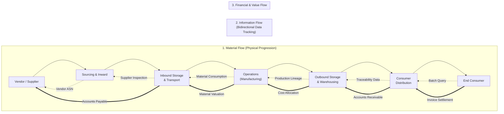
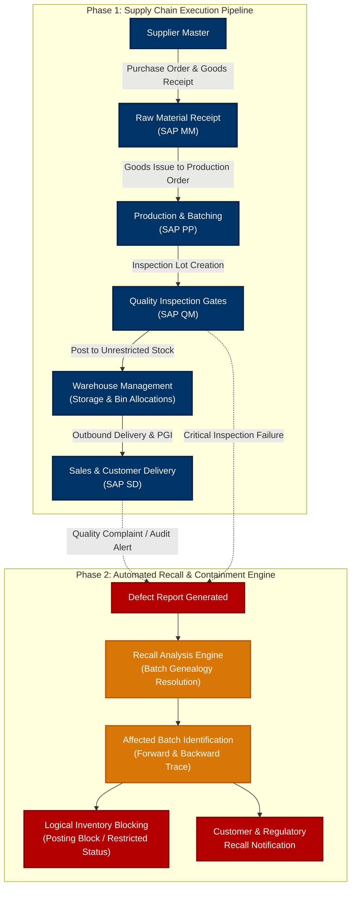
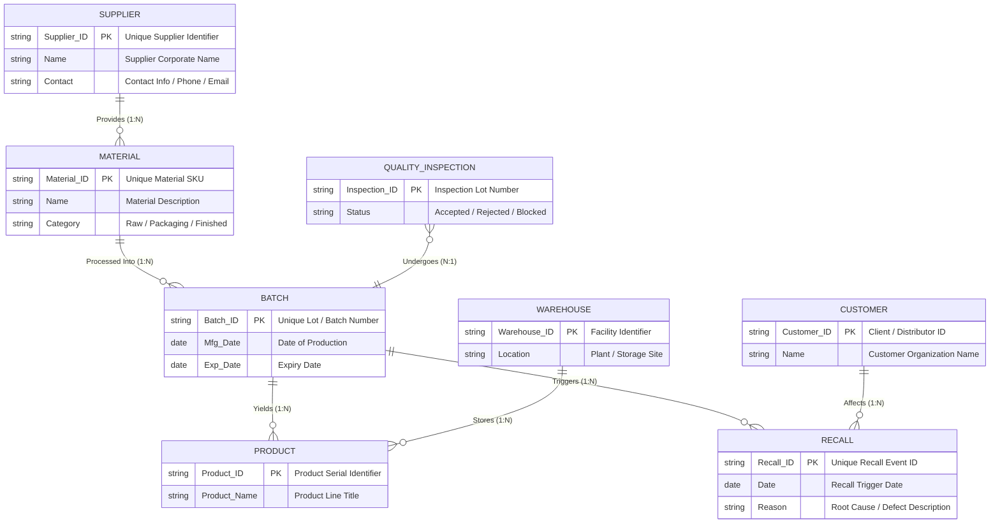

# SAP Product Recall & Traceability System
### *An Intelligent ERP Solution for End-to-End Product Tracking, Batch Genealogy, and Automated Recall Management*

---

## 📌 Executive Summary

Modern multi-echelon supply chains face unprecedented challenges in maintaining strict quality compliance, consumer safety, and end-to-end operational visibility. When a defective component or compromised batch enters circulation, delayed identification can lead to severe brand damage, catastrophic financial losses, and heavy regulatory penalties from agencies such as the FDA, EMA, and ISO bodies.

The **SAP Product Recall & Traceability System** is an enterprise-grade ERP architecture designed to deliver complete bidirectional traceability across the entire manufacturing and distribution lifecycle. By integrating core SAP modules—**Materials Management (MM)**, **Production Planning (PP)**, **Quality Management (QM)**, and **Sales & Distribution (SD)**—with an automated **Recall Analysis Engine**, the system provides instant batch genealogy, rapid inventory containment, and automated regulatory reporting through modern **SAP Fiori** interfaces.

---

## 👥 Academic & Project Metadata

| Field | Details |
| :--- | :--- |
| **Project Title** | SAP Product Recall & Traceability System |
| **Subtitle** | An Intelligent ERP Solution for End-to-End Product Tracking and Automated Recall Management |
| **Contributors** | **Soumyadeep Dafadaar** |
| **Domain** | Enterprise Resource Planning (ERP), Supply Chain Management (SCM), SAP S/4HANA |

---

## ⚠️ Problem Statement

In discrete manufacturing and process industries (e.g., Pharmaceuticals, Automotive, Food & Beverage, and Chemicals), tracing a defective component back to its root cause or identifying every distributed end-product poses severe operational bottlenecks:

1. **Information Silos:** Data fragmented across vendor procurement receipts, workshop floor production lines, warehouse storage bins, and distributor shipment manifests.
2. **Prolonged Recall Latency:** Identifying contaminated or defective batches manually takes days or weeks, allowing compromised products to reach end-consumers.
3. **Severe Financial & Legal Exposure:** Inefficient recalls result in massive inventory write-offs, legal liabilities, regulatory sanctions, and customer churn.
4. **Lack of Automated Containment:** Traditional setups lack immediate logical blocking of affected inventory across multi-location warehouses and in-transit shipments.

### Proposed Solution Need
An integrated, centralized SAP-based traceability platform capable of tracking products across supplier intake, manufacturing batches, finished goods inventory, and customer distribution networks, executing automated logical holds and targeted recalls within minutes of defect detection.

---

## 🎯 Core Project Objectives

- **End-to-End Bidirectional Tracking:** Maintain continuous traceability forward (from raw materials to finished products and customers) and backward (from customer complaints back to specific production lots and vendor supplies).
- **Rapid Batch Identification:** Instantly isolate affected batch numbers, storage locations, transit units, and delivered consignments upon defect confirmation.
- **Root-Cause Defect Traceability:** Seamlessly correlate quality test failures with specific supplier deliveries, machine work centers, and processing conditions.
- **Workflow Automation & Inventory Containment:** Trigger instant automated recall workflows, lock compromised batches logically across warehouse management systems, and notify stakeholders.
- **Compliance & Analytics Reporting:** Generate standardized audit logs, defect frequency metrics, and regulatory compliance reports via intuitive SAP Fiori dashboards.

---

## 🔄 Supply Chain Information & Material Flow

The system orchestrates three concurrent synchronization layers across the enterprise network:



---

## 🏗️ Proposed System Architecture & Integration Workflow

The end-to-end workflow binds transactional SAP ERP modules together with an event-driven **Recall Analysis Engine**:



### Module Responsibilities:
1. **SAP MM (Materials Management):** Handles vendor procurement, purchase orders, goods receipt (`MIGO`), and raw material quality verification.
2. **SAP PP (Production Planning):** Manages bills of materials (BOM), production routing, work centers, and assigns unique, non-fungible Batch IDs.
3. **SAP QM (Quality Management):** Generates inspection lots, executes sample testing against tolerance limits, and assigns usage decisions (`Accepted` / `Rejected`).
4. **SAP WM / EWM (Warehouse Management):** Tracks storage bins, handling units, internal stock transfers, and executes instant bin-level locking.
5. **SAP SD (Sales & Distribution):** Manages customer sales orders, delivery notes, shipping documents, and recipient logs for customer-level recall mapping.
6. **Recall Analysis Engine:** Traverses the entire batch lineage graph in real time to locate all parent, sibling, and child batch variants across active warehouses and delivered consignments.

---

## 📋 Methodology & Implementation Lifecycle

```
[1. Registration] ──▶ [2. Batching] ──▶ [3. Tracking] ──▶ [4. Inspection] ──▶ [5. Tracing] ──▶ [6. Containment] ──▶ [7. Analytics]
```

### 1. Master & Transactional Data Registration
- Maintain central registers of verified suppliers, raw material master records (`MARA`), and active production line specifications in the SAP database.
- Establish strict tracking requirements for all direct production ingredients and serialized components.

### 2. Unique Batch Identification Assignment
- Generate unique alphanumeric Batch IDs upon goods receipt of raw materials and completion of finished production orders.
- Capture manufacturing date (`Mfg_Date`), shelf-life expiration date (`Exp_Date`), production line ID, and shift metadata into the batch master.

### 3. Comprehensive Movement Tracking
- Log every physical movement using standardized SAP movement types (e.g., `101` Goods Receipt, `261` Goods Issue to Order, `311` Storage Location Transfer, `601` Goods Issue for Delivery).
- Record end-to-end custody chains linking internal warehouse bins directly to customer delivery numbers.

### 4. Quality Gate Inspection
- Trigger automated Quality Inspection lots (`SAP QM`) at critical operational junctures: intake receipt, post-production, and pre-shipment.
- Flag non-compliant lots immediately; isolate samples that fail chemical, physical, or packaging tolerance thresholds.

### 5. Rapid Batch Lineage Tracing
- When a defect is discovered, execute multi-level recursive batch determination (top-down customer trace and bottom-up supplier trace).
- Pinpoint all finished product batches that consumed raw material from a compromised lot.

### 6. Automated Logical Inventory Blocking & Recall
- Immediately flip stock status from `Unrestricted-Use` to `Blocked Stock` (`S` status) across all plants and storage locations.
- Restrict pending sales orders, stop shipments in transit, and generate formal recall notices detailing affected serials, quantities, and return instructions.

### 7. Analytical Dashboards & Fiori Visualization
- Deliver role-based SAP Fiori applications for plant managers, quality directors, and compliance auditors.
- Monitor live KPIs: active recalls, containment ratios, batch expiration schedules, and vendor quality reliability indices.

---

## 🗄️ Database Architecture & Data Dictionary (DDIC)

### Database Entity Specifications

| Entity Name | Primary Key | Key Attributes | Cardinality & Foreign Relationships | Business Function |
| :--- | :--- | :--- | :--- | :--- |
| **`Supplier`** | `Supplier_ID` | `Name`, `Contact`, `Address`, `Rating` | `1 : N` with `Material` | Master record for raw material vendors |
| **`Material`** | `Material_ID` | `Name`, `Category`, `Base_Unit`, `Shelf_Life` | `N : 1` with `Supplier`<br>`1 : N` with `Batch` | Catalog of components and finished goods |
| **`Batch`** | `Batch_ID` | `Mfg_Date`, `Exp_Date`, `Material_ID`, `Status` | `N : 1` with `Material`<br>`1 : N` with `Product`<br>`1 : N` with `Quality_Inspection`<br>`1 : N` with `Recall` | Unique production/intake lot identifier |
| **`Product`** | `Product_ID` | `Product_Name`, `Batch_ID`, `Warehouse_ID`, `Serial_No` | `N : 1` with `Batch`<br>`N : 1` with `Warehouse` | Finished saleable inventory units |
| **`Warehouse`** | `Warehouse_ID` | `Location`, `Capacity`, `Type`, `Manager` | `1 : N` with `Product` | Storage plants and distribution hubs |
| **`Customer`** | `Customer_ID` | `Name`, `Contact`, `Shipping_Address`, `Region` | `1 : N` with `Recall` | Commercial recipients and end-clients |
| **`Recall`** | `Recall_ID` | `Batch_ID`, `Customer_ID`, `Date`, `Reason`, `Severity`, `Status` | `N : 1` with `Batch`<br>`N : 1` with `Customer` | Audit document tracking containment action |
| **`Quality_Inspection`** | `Inspection_ID` | `Batch_ID`, `Status`, `Test_Date`, `Inspector`, `Defect_Code` | `N : 1` with `Batch` | Inspection lot test outcomes and usage decision |

---

## 📊 Entity-Relationship (ER) Visual Model

The relational model below illustrates entity connections, primary/foreign key associations, and operational cardinality:



---

## 🖥️ SAP Fiori User Interface & Analytical Reporting

The front-end user experience is realized via **SAP Fiori**, delivering responsive, role-based Launchpad tiles:

1. **Batch Genealogy Explorer (Where-Used List):**
   - Interactive tree visualization tracking raw material input lots through multiple intermediate production steps down to final consumer deliveries.
2. **Quality Inspection & Gate Monitor:**
   - Real-time display of active inspection lots, defect categorization, and single-click quarantine decisions.
3. **Recall Command Center:**
   - Immediate trigger interface to initiate system-wide inventory blocking.
   - Live containment gauge showing percentage of affected units secured vs. units still in transit or at distributor sites.
4. **Regulatory Audit & Compliance Exporter:**
   - Generates one-click regulatory disclosure packets (FDA Title 21 CFR Part 11 compliant) containing complete chain-of-custody logs.

---

## 📈 System Value & Operational Impact

```
┌──────────────────────────────────────┐       ┌──────────────────────────────────────┐
│       Traditional Manual Recall      │       │     SAP Automated Traceability       │
├──────────────────────────────────────┤       ├──────────────────────────────────────┤
│ ⏱️ Resolution Time: 5 - 14 Days      │  ──▶  │ ⚡ Resolution Time: Under 15 Minutes │
│ 📦 Scope: Broad, indiscriminate pull │       │ 🎯 Scope: Surgical batch-level hold   │
│ 💸 Financial Loss: High write-offs   │       │ 🛡️ Financial Loss: Minimized waste   │
│ ⚖️ Compliance Risk: High penalties   │       │ 📜 Compliance Risk: Guaranteed audit │
└──────────────────────────────────────┘       └──────────────────────────────────────┘
```

- **Rapid Risk Mitigation:** Reduces recall response time from weeks to minutes, preventing wider product dissemination.
- **Consumer Safety Assurance:** Swiftly halts compromised batches before end-user consumption or deployment.
- **Precision Containment:** Prevents unnecessary recall of unaffected batches, safeguarding brand reputation and operational revenue.
- **Audit-Ready Regulatory Compliance:** Standardizes documentation for global regulatory reporting without manual compilation overhead.

---

## 🔮 Future Scope & Technological Enhancements

The modular foundation of the SAP Product Recall & Traceability System supports future enterprise extensions:

1. 🤖 **AI-Based Defect & Failure Prediction:**
   - Machine learning algorithms trained on historical sensor logs and vendor performance to forecast batch failures prior to final packaging.
2. 📡 **IoT-Enabled Real-Time Environmental Tracking:**
   - Integration with smart RFID and sensor tags to continuously monitor cold-chain temperatures, humidity, and location in transit.
3. 🔗 **Enterprise Blockchain for Immutable Custody:**
   - Hyperledger or Ethereum-based distributed audit trail ensuring tamper-proof provenance records across multi-enterprise supply partners.
4. 📱 **Mobile SAP Fiori & Barcode Scanning Application:**
   - Native mobile capabilities empowering warehouse personnel and field inspectors to scan QR/barcodes for instant batch verification and quarantine.
5. 📊 **Predictive Supplier Quality Analytics:**
   - Automated vendor scorecard updates adjusting procurement quotas dynamically based on incoming defect rates.

---

## 🏁 Conclusion

The **SAP Product Recall & Traceability System** delivers a robust, scalable, and intelligent ERP solution to solve one of the manufacturing sector's most critical vulnerabilities: delayed product recalls. By combining unified batch tracking, multi-module SAP integration, automated inventory containment, and intuitive Fiori analytics, the system provides organizations with complete supply chain transparency, heightened regulatory compliance, and unparalleled consumer safety.
